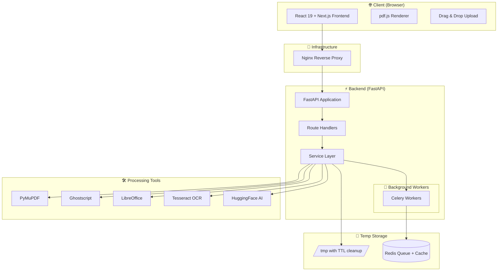

<h1 align="center">PDFForge</h1>

<p align="center">
  <strong>The Free, Privacy-First PDF Processing Platform</strong>
</p>

<p align="center">
  <a href="#features"></a>
  <a href="#tech-stack"></a>
  <a href="#tech-stack"></a>
  <a href="LICENSE"></a>
</p>

<p align="center">
  <a href="#quick-start">Quick Start</a> •
  <a href="#features">Features</a> •
  <a href="#api-documentation">API Docs</a> •
  <a href="#architecture">Architecture</a> •
  <a href="#deployment">Deployment</a> •
  <a href="#contributing">Contributing</a>
</p>

---

## 🌟 Why PDFForge?

PDFForge is a **completely free**, **stateless**, **no-authentication** PDF processing platform built for everyone — students, lawyers, freelancers, and enterprises. No sign-ups, no data stored, no compromises.

| Feature | PDFForge | Smallpdf | iLovePDF | Adobe Online |
|---------|----------|----------|----------|--------------|
| 100% Free | ✅ | ❌ | ❌ | ❌ |
| No Account Required | ✅ | ❌ | ❌ | ❌ |
| AI-Powered Analysis | ✅ | ❌ | ❌ | Limited |
| Self-Hostable | ✅ | ❌ | ❌ | ❌ |
| Open Source | ✅ | ❌ | ❌ | ❌ |
| Privacy-First | ✅ | Partial | Partial | Partial |
| Batch Processing | ✅ | Limited | Limited | Limited |

---

## ✨ Features

### 📝 PDF Editing
- Text and image editing with precise positioning
- Annotations, highlighting, and drawing tools
- Page rotation, deletion, and insertion
- Watermark addition and removal

### 🔄 Conversion (40+ formats)
- **PDF → Word** (DOCX) with layout preservation
- **PDF → Excel** (XLSX) with table detection
- **PDF → PowerPoint** (PPTX)
- **PDF → Images** (JPG, PNG, TIFF, WebP)
- **Reverse conversion** (Word/Excel/PPT/Images → PDF)
- Batch processing support

### 📦 Document Management
- **Merge** multiple PDFs into one
- **Split** by pages, ranges, or bookmarks
- **Extract** specific pages
- **Reorder** pages with drag-and-drop

### 🗜️ Compression
- Multiple quality levels (Screen, eBook, Printer, Prepress)
- Ghostscript-powered optimization
- Before/after size comparison
- Web and email optimized output

### 🤖 AI Features (Phase 3)
- **Summarization** — Get concise summaries of any PDF
- **Chat with Document** — Ask questions with RAG-powered context
- **Translation** — Translate documents between languages
- **Semantic Search** — Find content by meaning, not just keywords

### 🔒 Security
- **Redaction** of sensitive data (PII, SSN, etc.)
- **Password protection** and encryption
- **Automatic file deletion** (30-minute TTL)
- Rate limiting and malware protection

---

## 🏗️ Architecture



---

## 🛠️ Tech Stack

### Backend
| Technology | Purpose |
|-----------|---------|
| **FastAPI** | High-performance async API framework |
| **PyMuPDF (fitz)** | PDF editing, rendering, text extraction |
| **pypdf** | PDF manipulation (merge, split, rotate) |
| **pdfplumber** | Advanced text and table extraction |
| **reportlab** | PDF generation from scratch |
| **Pillow + OpenCV** | Image processing and manipulation |
| **Tesseract OCR** | Optical character recognition |
| **LibreOffice** | High-fidelity Office ↔ PDF conversion |
| **Ghostscript** | PDF compression and optimization |
| **Celery + Redis** | Background task processing |
| **HuggingFace + FAISS** | AI-powered document analysis |

### Frontend
| Technology | Purpose |
|-----------|---------|
| **React 19 + Next.js** | Modern UI framework |
| **Tailwind CSS + shadcn/ui** | Premium design system |
| **pdf.js** | Native PDF rendering |
| **Framer Motion** | Buttery smooth animations |
| **Zustand** | Lightweight state management |

### Infrastructure
| Technology | Purpose |
|-----------|---------|
| **Docker** | Containerized deployment |
| **Nginx** | Reverse proxy + caching + security |
| **Redis** | Task queue + result caching |
| **Gunicorn + Uvicorn** | Production ASGI server |

---

## 🚀 Quick Start

### Prerequisites
- Docker & Docker Compose v2+
- 4-8 GB RAM minimum (16 GB recommended for AI features)
- Git

### One-Command Deploy
```bash
git clone https://github.com/your-username/pdfforge.git
cd pdfforge
cp backend/.env.example backend/.env
docker compose up --build -d
```

The application will be available at:
- **Frontend**: http://localhost:3000
- **API**: http://localhost:8000
- **API Docs**: http://localhost:8000/docs
- **Health Check**: http://localhost:8000/health

### Local Development (without Docker)

#### Backend
```bash
cd backend
python -m venv venv
source venv/bin/activate  # Windows: venv\Scripts\activate
pip install -r requirements.txt

# Start Redis (required for Celery)
redis-server

# Start Celery worker (new terminal)
celery -A app.core.celery_app worker --loglevel=info

# Start FastAPI dev server
uvicorn app.main:app --reload --host 0.0.0.0 --port 8000
```

#### Frontend
```bash
cd frontend
pnpm install
pnpm dev
```

---

## 📡 API Documentation

### Base URL
```
http://localhost:8000/api/v1
```

### Core Endpoints

#### PDF Operations
| Method | Endpoint | Description |
|--------|----------|-------------|
| `POST` | `/pdf/merge` | Merge multiple PDFs |
| `POST` | `/pdf/split` | Split PDF by page ranges |
| `POST` | `/pdf/compress` | Compress PDF with quality options |
| `POST` | `/pdf/rotate` | Rotate pages |
| `POST` | `/pdf/delete-pages` | Remove specific pages |
| `POST` | `/pdf/reorder` | Reorder pages |
| `POST` | `/pdf/extract-pages` | Extract page range |
| `POST` | `/pdf/add-watermark` | Add text/image watermark |
| `POST` | `/pdf/protect` | Password protect PDF |
| `POST` | `/pdf/unlock` | Remove password protection |
| `POST` | `/pdf/redact` | Redact sensitive content |
| `POST` | `/pdf/ocr` | OCR scanned documents |
| `POST` | `/pdf/extract-text` | Extract all text |
| `POST` | `/pdf/extract-images` | Extract embedded images |
| `POST` | `/pdf/metadata` | Get/set PDF metadata |

#### Conversion
| Method | Endpoint | Description |
|--------|----------|-------------|
| `POST` | `/convert/pdf-to-word` | PDF → DOCX |
| `POST` | `/convert/pdf-to-excel` | PDF → XLSX |
| `POST` | `/convert/pdf-to-pptx` | PDF → PPTX |
| `POST` | `/convert/pdf-to-images` | PDF → JPG/PNG |
| `POST` | `/convert/word-to-pdf` | DOCX → PDF |
| `POST` | `/convert/excel-to-pdf` | XLSX → PDF |
| `POST` | `/convert/pptx-to-pdf` | PPTX → PDF |
| `POST` | `/convert/images-to-pdf` | Images → PDF |

#### AI Features
| Method | Endpoint | Description |
|--------|----------|-------------|
| `POST` | `/ai/summarize` | Summarize PDF content |
| `POST` | `/ai/chat` | Chat with document (RAG) |
| `POST` | `/ai/translate` | Translate document |
| `POST` | `/ai/search` | Semantic search in PDF |

#### Utility
| Method | Endpoint | Description |
|--------|----------|-------------|
| `GET`  | `/health` | Health check |
| `GET`  | `/tasks/{task_id}` | Poll background task status |
| `GET`  | `/download/{file_id}` | Download processed file |

### Example Request
```bash
# Merge two PDFs
curl -X POST http://localhost:8000/api/v1/pdf/merge \
  -F "files=@document1.pdf" \
  -F "files=@document2.pdf" \
  -o merged.pdf

# Compress PDF
curl -X POST http://localhost:8000/api/v1/pdf/compress \
  -F "file=@large-document.pdf" \
  -F "quality=ebook" \
  -o compressed.pdf

# AI Summarize
curl -X POST http://localhost:8000/api/v1/ai/summarize \
  -F "file=@research-paper.pdf" \
  -F "max_length=500"
```

---

## ⚙️ Configuration

### Environment Variables

| Variable | Default | Description |
|----------|---------|-------------|
| `APP_ENV` | `development` | Environment (development/staging/production) |
| `APP_HOST` | `0.0.0.0` | Server bind host |
| `APP_PORT` | `8000` | Server bind port |
| `MAX_UPLOAD_SIZE_MB` | `100` | Maximum file upload size |
| `TEMP_FILE_TTL_MINUTES` | `30` | Auto-delete temp files after N minutes |
| `REDIS_URL` | `redis://localhost:6379/0` | Redis connection URL |
| `CELERY_BROKER_URL` | `redis://localhost:6379/1` | Celery broker URL |
| `CELERY_RESULT_BACKEND` | `redis://localhost:6379/2` | Celery results backend |
| `CORS_ORIGINS` | `["http://localhost:3000"]` | Allowed CORS origins |
| `RATE_LIMIT_PER_MINUTE` | `60` | API rate limit per IP |
| `GHOSTSCRIPT_PATH` | `gs` | Path to Ghostscript binary |
| `LIBREOFFICE_PATH` | `soffice` | Path to LibreOffice binary |
| `TESSERACT_PATH` | `tesseract` | Path to Tesseract binary |
| `ENABLE_AI_FEATURES` | `false` | Enable AI features (requires more RAM) |
| `AI_MODEL_NAME` | `facebook/bart-large-cnn` | Summarization model |
| `EMBEDDING_MODEL` | `all-MiniLM-L6-v2` | Sentence embedding model |

---

## 🐳 Deployment

### Production (Docker Compose)
```bash
# Build and start all services
docker compose -f docker-compose.yml up --build -d

# View logs
docker compose logs -f backend

# Scale Celery workers
docker compose up -d --scale celery-worker=4

# Stop all
docker compose down
```

### System Requirements

| Setup | RAM | CPU | Storage | GPU |
|-------|-----|-----|---------|-----|
| **Minimum (MVP)** | 4 GB | 2 cores | 10 GB SSD | ❌ |
| **Recommended** | 8 GB | 4 cores | 20 GB SSD | ❌ |
| **Full AI Features** | 16+ GB | 4+ cores | 50 GB SSD | Optional (CUDA) |

---

## 🤝 Contributing

We welcome contributions! Please see our [Contributing Guide](CONTRIBUTING.md) for details.

1. Fork the repository
2. Create your feature branch (`git checkout -b feature/amazing-feature`)
3. Commit your changes (`git commit -m 'Add amazing feature'`)
4. Push to the branch (`git push origin feature/amazing-feature`)
5. Open a Pull Request

---

## 📄 License

This project is licensed under the MIT License — see the [LICENSE](LICENSE) file for details.

---

<p align="center">
  <strong>⭐ If PDFForge helps you, please give it a star! ⭐</strong>
</p>

<p align="center">
  Built with ❤️ for the open-source community
</p>

---

## 👨‍💻 Owner & Creator

**Abdessamad Lahlaoui**
- 📧 **Email**: <a href="mailto:abdessamadlahlaoui0@gmail.com">abdessamadlahlaoui0@gmail.com</a>
- 💼 **LinkedIn**: <a href="https://www.linkedin.com/in/abdessamad-lahlaoui-315615253/">Abdessamad Lahlaoui</a>
